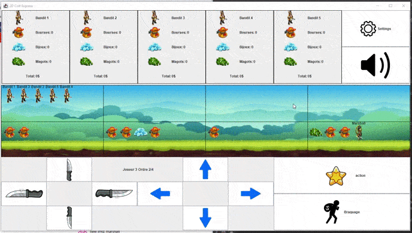
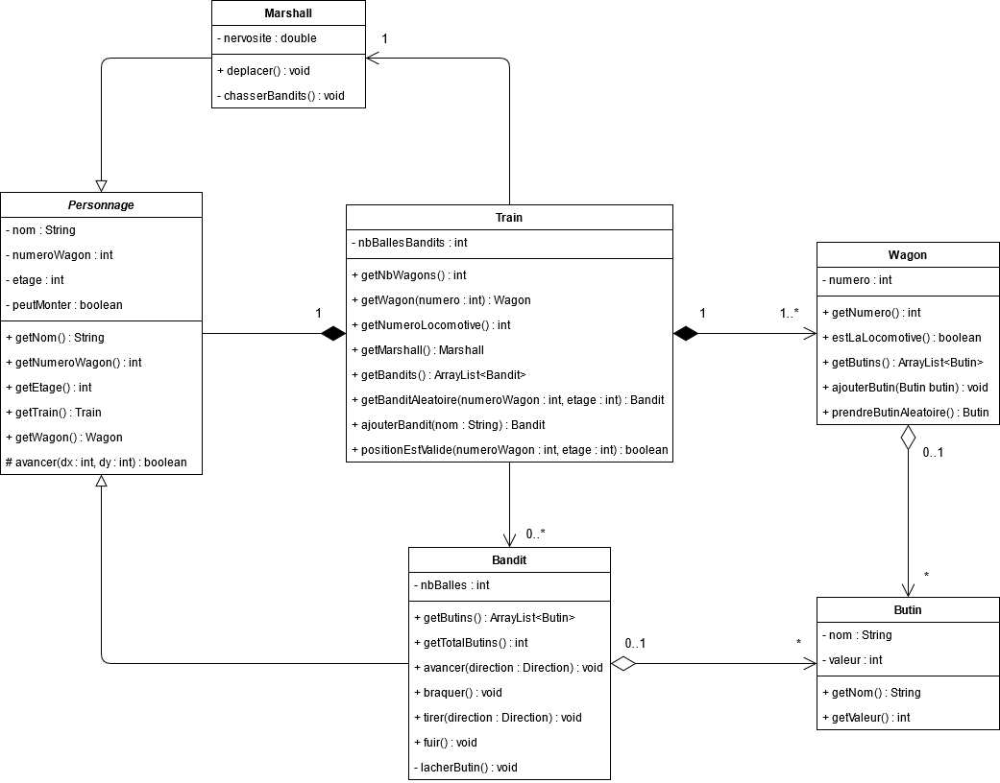
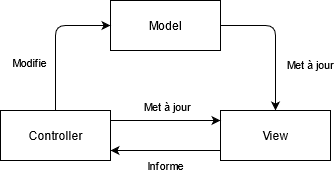
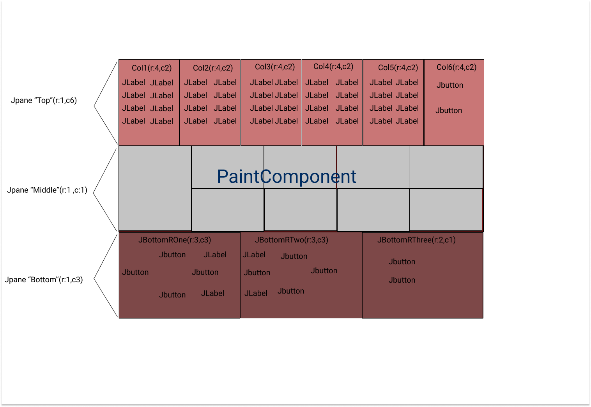

# Projet POGL
2D Game Colt Express JDK 15 to execute
## Aperçu du Résultat

## Parties Traitées

Tout ?

## Diagramme de Classes (Modèle)

## MVC

## Maquette Grid

## Références
- Images : https://www.shutterstock.com/fr/image-vector/cartoon-game-objects-2d-art-object-655253794  
- Class : 
    - Swing : https://docs.oracle.com/javase/7/docs/api/javax/swing/package-summary.html
    - Awt : https://docs.oracle.com/javase/7/docs/api/java/awt/package-summary.html
- Diagrammes : https://app.diagrams.net/
- Music : https://www.youtube.com/watch?v=dDJQ-jqHFm0&list=PL2IDwIO1bux259XIlNk6rx1Kbo7qyZtNx&index=5

## Contributeurs

- [Colin Nakache](https://gitlab.u-psud.fr/colin.nakache) (principalement le modèle : fonctionnement du jeu)
- [Rachad Wail Said](https://gitlab.u-psud.fr/rachad.said) (principalement l'interface : vue et contrôleur)